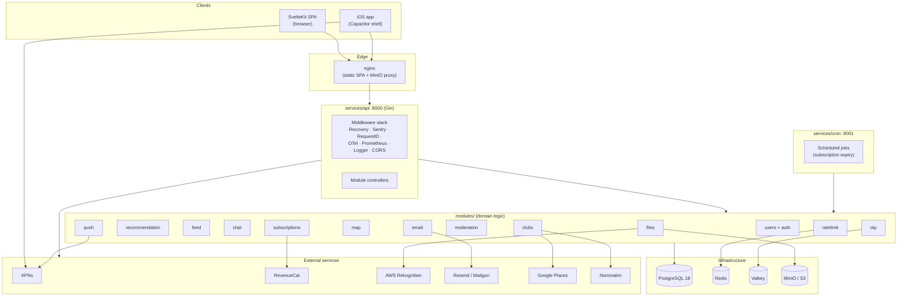
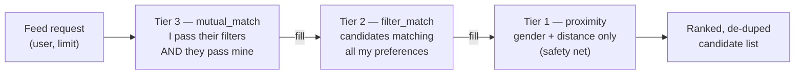
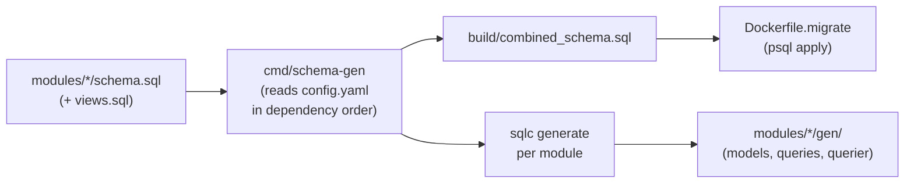

# MatchUp — Comprehensive Technical Overview

> A complete breakdown of the MatchUp platform from the engineering side: the
> problem space, the architecture, the full technology stack, every third‑party
> integration, the data model, the operational tooling, and the current state of
> development.
>
> This document deliberately focuses on **how the system is built**, not on the
> business/economic case (covered separately). It is meant to be exported and
> linked as a standalone technical dossier.

---

## 1. Executive Summary

**MatchUp** is a vertical, mobile‑first matching platform for the **ballroom /
DanceSport** community. It applies the familiar "swipe to match" interaction
model to a real, underserved problem: dancers, their parents, trainers, and
dance clubs have no dedicated tool to find each other. MatchUp lets a dancer
find a **dance partner**, discover **trainers** and **clubs** nearby, chat once
matched, and locate the local scene on a map — with a recommendation engine that
ranks candidates by mutual compatibility and proximity.

At a glance:

| Dimension | Choice |
|---|---|
| **Product** | DanceSport partner / trainer / club matching (Tinder‑style) |
| **Primary market** | Ukraine (default locale `uk`, English available) |
| **Backend** | Go 1.25 modular monolith (Gin + pgx + sqlc) |
| **Frontend** | SvelteKit 2 / Svelte 5 (runes) SPA, Tailwind v4 |
| **Mobile** | Capacitor iOS shell (App ID `com.matchup.app`) with native APNs push |
| **Database** | PostgreSQL 18 (schema‑first, sqlc‑generated access) |
| **Caching / limits** | Valkey (OTP) + Redis (rate limiting) |
| **Object storage** | MinIO locally, S3‑compatible in production |
| **Deployment** | Docker Compose; nginx serves the static frontend |
| **Observability** | OpenTelemetry → Tempo, Prometheus, Loki, Grafana, Sentry, PostHog |
| **Auth providers** | Email/password (native) + Google OAuth (ID-token; web GIS + Capacitor native) |

The codebase is a **monorepo** containing the Go backend, the SvelteKit
frontend, the iOS native shell, infrastructure definitions, and developer
tooling.

---

## 2. The Problem MatchUp Solves

The competitive/social dance world is fragmented and runs on word‑of‑mouth,
Instagram DMs, and trainer networks. MatchUp targets several concrete pain
points:

1. **Finding a dance partner.** Couple dances (Standard/Latin) require a partner
   matched on a surprising number of dimensions — gender, age, height, skill
   level (goal/program), competitive category, location, and willingness to
   relocate or co‑finance. MatchUp turns this into a structured, filterable,
   two‑sided matching problem.
2. **Discovering trainers.** Dancers and parents need to find coaches; trainers
   need visibility and a channel to reach prospective students.
3. **Discovering clubs.** Clubs anchor the local scene. MatchUp maps them,
   supports membership, ownership claims, and a club inbox.
4. **Parents of junior dancers.** A dedicated `parent` account type lets parents
   search on behalf of children — a real workflow in junior DanceSport.
5. **Safe communication.** Matching only unlocks chat on mutual interest, with
   keyword filtering, blocking, and reporting built in.

The four first‑class entity types — **dancer, parent, trainer, club** — are
modeled explicitly throughout the stack (`account_type` discriminator), with
different navigation and permissions for each.

---

## 3. High‑Level Architecture

MatchUp is a **modular monolith** on the backend: all domain logic lives in
self‑contained `modules/`, and thin `services/` provide the runnable HTTP
processes. This gives microservice‑style boundaries (each module owns its schema
slice and generated data access) without the operational overhead of many
deployables.



### Process topology

| Process | Path | Port | Role |
|---|---|---|---|
| **API** | `services/api` | 8000 | All HTTP endpoints, the product surface |
| **Cron** | `services/cron` | 8001 | Scheduled jobs (currently subscription expiry); health + metrics only |
| **Web** | nginx container | 8080 | Serves the prebuilt SvelteKit static bundle; proxies object‑storage URLs |
| **Migrate** | one‑shot container | — | Applies schema/migrations before the API starts |

The frontend is built to **static files** (SvelteKit `adapter-static`, SPA mode)
and served by nginx; it is not a Node SSR server. The same bundle is wrapped by
Capacitor for the iOS app.

---

## 4. Backend (Go)

### 4.1 Language & framework stack

| Concern | Library | Notes |
|---|---|---|
| Language | **Go 1.25.0** | Module `github.com/Gooowan/matchup` |
| HTTP framework | **Gin** (`gin-gonic/gin`) | + `gin-contrib/cors`, `JGLTechnologies/gin-rate-limit` |
| DB driver | **pgx/v5** (`jackc/pgx`) | Connection pool, native Postgres types |
| Query layer | **sqlc** (generated) | Type‑safe Go from raw SQL |
| Auth | **golang-jwt/jwt/v5** | HS256 sessions; `golang.org/x/crypto` for password hashing |
| UUIDs | `google/uuid` | |
| Object storage | **minio-go/v7** | S3‑compatible (MinIO and AWS S3) |
| Redis / Valkey | `redis/go-redis/v9`, `valkey-io/valkey-go` | Rate limiting + OTP store |
| Email | `resend/resend-go/v2`, `mailgun/mailgun-go/v5` | Pluggable providers |
| Push | `sideshow/apns2` | Apple Push Notification service |
| Moderation | `aws-sdk-go-v2/service/rekognition` | Optional NSFW image scan |
| Scheduling | `robfig/cron/v3` | Cron service jobs |
| Tracing | `go.opentelemetry.io/otel` (+ `otelgin`) | OTLP/HTTP export |
| Metrics | `prometheus/client_golang` | `/metrics` endpoint |
| Errors | `getsentry/sentry-go` (+ gin) | Crash/error reporting |
| Config | `gopkg.in/yaml.v3` | |

### 4.2 Modular‑monolith layout

```
modules/
├── core/            # Shared infra — NO domain schema, NO routes
│   ├── db/          #   pgx pool bootstrap
│   ├── logging/     #   slog JSON logger + context helpers
│   ├── middleware/  #   Sentry, RequestID, Prometheus, RequestLogger
│   ├── tracing/     #   OpenTelemetry init + DB span helpers
│   ├── metrics/     #   Prometheus collectors + DB pool gauges
│   ├── types/       #   Resp envelope, JSONB, Config
│   ├── http/        #   JSON bind helpers
│   ├── geocoding/   #   Nominatim + city‑centroid fallback
│   ├── gmaps/       #   Google Places client
│   └── utils/       #   UUID helpers
├── users/           # Identity: accounts, roles, profile data, inviter graph
│   └── auth/        #   JWT issuance/validation, registration, OTP controller
├── recommendation/  # Profiles, preferences, 3-tier discovery engine
│   ├── tier1/  tier2/  tier3/   # candidate providers (see §4.5)
├── feed/            # Swipe feed, mutual-match detection, chat creation, push
├── chat/            # DM + club chats, read receipts, keyword filtering
├── clubs/           # Clubs, members, trainers, ownership, gmaps import
├── map/             # User locations, nearby discovery
├── files/           # Object storage (avatars/photos/materials) + Rekognition
├── moderation/      # Blocks, reports, admin ban
├── subscriptions/   # Plans, entitlements, RevenueCat webhook
├── push/            # APNs device tokens + notifications
├── otp/             # Short-lived codes in Valkey
├── ratelimit/       # Redis-backed limiter middleware
└── email/           # Template-based transactional email (Resend/Mailgun/mock)
```

### 4.3 Layering & conventions

Every domain module follows the same internal shape:

| Layer | File | Responsibility |
|---|---|---|
| **Controller** | `controller.go` | Gin handlers + `RegisterRoutes(group, mw...)` |
| **Service** | `service.go` | Business logic, transactions, cross‑module calls |
| **Repository** | `gen/` (sqlc) | Type‑safe queries on the pgx pool |
| **Custom DTOs** | `gen/1custom.go` | Hand‑written helpers sqlc won't overwrite |
| **Schema** | `schema.sql` (+ `views.sql`) | The module's slice of the DB |
| **Queries** | `queries/*.sql` | Raw SQL compiled by sqlc |

**Dependency injection is manual and explicit** in `services/api/main.go`:
services are constructed with their dependencies passed in, and cross‑module
wiring is visible in one place. A couple of late‑binding setters break
initialization cycles (e.g. `authService.SetOTPService(...)`,
`feedSvc.PushSvc = pushSvc`).

**Uniform response envelope** — every endpoint returns:

```go
type Resp struct {
    ErrorCode string `json:"error_code,omitempty"`
    Error     any    `json:"error,omitempty"`
    Data      any    `json:"data"`
}
```

This is what lets the frontend's `parseApiError` reliably map `error_code` to
localized user messages.

### 4.4 Middleware stack (API)

Applied in order on the root router:

```
Recovery → Sentry → RequestID → OpenTelemetry (otelgin)
        → Prometheus metrics → Request logger → CORS
```

Authorization is per‑route via `auth.RequireAuth(...)` (any logged‑in user) and
`auth.RequireAdmin(...)` (role `ADMIN`). Rate limiters are injected on sensitive
endpoints individually (login, register, swipe, messages, uploads).

### 4.5 The recommendation engine (deep dive)

The discovery engine is the technical centerpiece. It is a **three‑tier
candidate pipeline** that degrades gracefully so the feed is never empty.



| Tier | Package | Query | Logic |
|---|---|---|---|
| **Tier 3** | `recommendation/tier3` | `GetMutualMatchProfiles` | Two‑sided: candidate passes **my** filters **and** my profile passes **their** preferences; distance‑ordered |
| **Tier 2** | `recommendation/tier2` | `FindNearbyVisibleProfiles` | One‑sided: all **my** preference filters applied; distance‑ordered |
| **Tier 1** | `recommendation/tier1` | `FindNearbyVisibleProfiles` | **Gender + distance only** — fallback that keeps the feed populated |

The `Recommender` walks tiers in **quality order** (3 → 2 → 1), deduplicating by
user ID until `limit` is reached. Each tier implements a common interface:

```go
type CandidateProvider interface {
    GetCandidates(ctx context.Context, params FeedParams) ([]Candidate, error)
}
```

Supporting details:

- **Reference coordinates for distance**: a user's primary club lat/lng, falling
  back to a city centroid (`geocoding.CityLatLng`) — distance is computed with a
  haversine expression in SQL.
- **Filters are nullable columns** (`sqlc.narg(...)`): a `NULL` preference means
  "no filter on this dimension," so the same query serves all tiers.
- **Exclusions**: previously swiped users (`matches`) and blocked users
  (`moderation`) are filtered out.
- **ML‑ready logging**: every LIKE asynchronously writes a feature snapshot to
  `recommendation_likes_log` (via `ProfileToFeatures`) — groundwork for a future
  learned ranking / collaborative‑filtering model.
- **Observability**: per‑tier Prometheus counters
  (`RecommendationTierHits / TierEmpty / TierErrors`).

The matching dimensions (from `profiles` / `user_preferences`): gender, age
range, height range, **goal** (hobby/competition level), **program**
(standard/latin), **categories** (juvenile/junior/etc.), country, city,
willingness to relocate, and willingness to co‑finance.

### 4.6 Feed, matching & chat creation

`modules/feed` owns the swipe action. On a swipe it:

1. Records LIKE/PASS in a transaction (`matches` table).
2. On a mutual LIKE, creates a DM chat via the `chat` service (**best-effort** — if chat creation fails the match rows are still committed and `is_mutual_match: true` is still returned; the chat is created on the next inbox open if it was missed).
3. Sends an APNs push to the newly matched user.
4. Increments swipe/match Prometheus counters.

**No-profile guard**: if `GetFeed` cannot resolve the caller's recommendation profile, it returns `ErrNoProfile` instead of silently returning an empty candidate list. The controller translates this to a `{ no_profile: true }` response field, which the frontend swipe page uses to show a "complete your profile" CTA instead of a blank deck.

**Swipe resilience**: the frontend uses an optimistic-removal pattern (card is removed immediately) but will re-insert the card and show a distinct toast on network failures or 429 rate-limit responses.

Ranking itself is delegated to the recommendation tiers — feed stays focused on
the transactional side of matching.

### 4.7 Authentication & sessions

- **JWT (HS256)** signed with `JWT_SECRET`; claims carry the user ID, a `nonce`,
  issuer (`APP_URL`), and audience (`JWT_AUDIENCE`).
- **Server‑side session invalidation**: each login increments
  `users.auth_nonce`; a token is only valid while its nonce matches the row —
  this gives instant "log out everywhere" semantics without a session store.
- **Transport**: `Authorization: Bearer` header **or** an `auth_token` cookie
  (the web app uses cookies with `credentials: include`).
- **OTP**: 5‑digit codes stored in **Valkey** (`otp:user:{id}:{purpose}`, 15‑min
  TTL, max 5 attempts) for email verification and password‑change flows;
  delivered via the email module.
- **Password reset**: email‑link token flow plus an authenticated in‑app change.
- **Extensibility**: `AuthService` supports a `RegistrationHook` for
  validate‑and‑post‑register logic inside the same transaction.
- **Banned-user enforcement**: the JWT middleware checks `users.role == 'banned'`
  immediately after token validation and returns `403 BANNED` before any handler
  runs — banned users cannot authenticate into any authenticated route.

#### 4.7.1 Google OAuth (ID-token verification)

Sign-in with Google is supported on both web and Capacitor native via an
ID-token verification flow — the frontend acquires an ID token from Google,
then POSTs it to the backend for server-side verification.

**Flow:**

```
Web:    Google Identity Services (GIS) → id_token
Native: @codetrix-studio/capacitor-google-auth → id_token
Both:   POST /auth/google { id_token }
          → backend: idtoken.Validate(token, GOOGLE_CLIENT_ID)
          → find user_identities row (provider='google', subject=sub)
          → OR find users row by verified email → link identity
          → OR create new user (no password, email pre-verified) → link identity
          → CreateJwtToken → auth_token cookie (same as email/password flow)
```

**Provider identity storage** — the `user_identities` table (see §5.2) decouples
external OAuth providers from the `users` table. One user can have multiple
linked identities (e.g. password + Google). The same table will accommodate
WebAuthn and Okta when those are added (see §11).

**Backend module**: `modules/users/auth/google_controller.go` — registered at
`POST /auth/google` in the auth group alongside the existing email/password and
OTP controllers.

**Required env vars**: `GOOGLE_CLIENT_ID` (backend verifier), `VITE_GOOGLE_CLIENT_ID`
(frontend GIS), `VITE_GOOGLE_IOS_CLIENT_ID` / `VITE_GOOGLE_ANDROID_CLIENT_ID`
(Capacitor native plugin).

### 4.7.2 Chat architecture (polymorphic 1:1 model)

The `chats` table supports two thread kinds using a single schema:

| Kind | Populated columns | Created by |
|---|---|---|
| **DM** (user ↔ user) | `user1_id`, `user2_id`; `club_id` NULL | Mutual match (feed swipe) or trainer direct-message |
| **Club chat** (user ↔ club) | `user1_id` (the dancer), `club_id`; `user2_id` NULL | `POST /clubs/:slug/chat` (idempotent create-or-get) |

`is_club_chat` (JSON field; previously misnamed `is_club_owner`) is `true` when
`club_id IS NOT NULL`. Both field names are emitted for backward compatibility.

**Known limitations** (intentional deferred scope):
- Only the club `owner_user_id` can read/reply to club chats; no staff roles without a `chat_participants` table.
- Messages always carry a `sender_id` — there is no "send as club" identity.
- No group chat; extend to `chat_participants(chat_id, participant_id)` if needed.
- Unclaimed clubs can receive messages; no one can reply until `owner_user_id` is set.

### 4.7.3 Message-level moderation

The moderation system was extended from user-level to message-level:

**User-facing**:
- Long-press / right-click any received message → action sheet with **Report message** and **Block user** options.
- `POST /chats/:chatId/messages/:messageId/report` — creates a `message_reports` row with a content snapshot.
- The block action calls the existing `/users/:id/block` endpoint (same user-block, triggered from chat context).

**Admin panel** (`/admin/moderation`):
- New **"Message Reports"** tab alongside user reports.
- Shows the reported content snapshot, the current message text (diff-highlighted if changed), a deep link to the chat thread, and three actions: **Hide + resolve** (soft-deletes the message and marks the report resolved), **Resolve** (mark resolved without hiding), **Dismiss**.
- Resolution is persisted server-side via `PATCH /admin/chats/message-reports/:id`.

**Hidden messages**: soft-delete sets `moderation_status = 'hidden'` and `deleted_at = NOW()`. All `ListMessages` queries (initial load, polling, and admin queries) filter out hidden messages — the content is not transmitted to clients.

### 4.8 Cron service

A separate process (`services/cron`, port 8001) running `robfig/cron`:

| Job | Schedule | Action |
|---|---|---|
| `ExpireSubscriptions` | every 5 min | Mark expired `user_subscriptions` as `finished` |
| `NotifyExpiringSoon` | hourly | List subs expiring within a day (currently logs only; email/push is a TODO) |

> Note: the cron container is **commented out** in `compose.yml` today (the code
> exists and is runnable; it just isn't part of the default stack yet).

---

## 5. Data Layer

### 5.1 Schema‑first with sqlc

MatchUp uses a **schema‑first** workflow: each module's `schema.sql` is the
source of truth, and `sqlc` generates type‑safe Go from raw SQL queries. The
twist is a **shared combined schema** so cross‑module foreign keys (e.g.
`profiles.primary_club_id → clubs.id`) resolve at generation time.



- `config.yaml` lists modules in dependency order: `core → users → files →
  clubs → recommendation → feed → chat → map → moderation → subscriptions`.
- `make gen` (i.e. `go run cmd/schema-gen/main.go`) rebuilds the combined schema
  **and** regenerates all `gen/` packages.
- JSONB columns map to a shared `core/types.JSONB`.

### 5.2 Core tables (by module)

| Module | Key tables |
|---|---|
| users | `users` (email, password, role, `auth_nonce`, verification/reset tokens, `profile_data` JSONB); `user_identities` (OAuth provider linking) |
| recommendation | `profiles`, `user_preferences`, `recommendation_likes_log` |
| feed | `matches` |
| chat | `chats`, `messages` (+ `moderation_status`, `deleted_at`), `chat_reads`, `message_reports` |
| clubs | `clubs`, `club_members`, `club_trainers`, `trainer_students` |
| map | `user_locations` |
| moderation | `blocks`, `reports` |
| files | `media` |
| subscriptions | `subscriptions`, `user_subscriptions` (+ expiry views) |
| push | `user_push_tokens` |

#### `user_identities` — OAuth provider registry

```sql
CREATE TABLE user_identities(
    id               uuid PRIMARY KEY DEFAULT gen_random_uuid(),
    user_id          uuid NOT NULL REFERENCES users(id) ON DELETE CASCADE,
    provider         varchar(32)  NOT NULL,   -- 'google' | 'okta' | 'webauthn' …
    provider_subject varchar(255) NOT NULL,   -- Google sub / Okta sub / WebAuthn cred ID
    email            varchar(255),            -- informational snapshot from provider
    created_at       timestamp NOT NULL DEFAULT CURRENT_TIMESTAMP,
    UNIQUE(provider, provider_subject)
);
```

One user can have many identity rows (multi-provider). The unique constraint on
`(provider, provider_subject)` ensures no two accounts share the same external
identity. Adding a new provider only requires a new row and a new backend handler.

#### `message_reports` — message-level moderation

```sql
CREATE TABLE message_reports(
    id               uuid PRIMARY KEY DEFAULT gen_random_uuid(),
    message_id       uuid NOT NULL REFERENCES messages(id) ON DELETE CASCADE,
    chat_id          uuid NOT NULL REFERENCES chats(id) ON DELETE CASCADE,
    reporter_id      uuid NOT NULL REFERENCES users(id) ON DELETE CASCADE,
    reported_user_id uuid NOT NULL REFERENCES users(id),
    category         varchar(50) NOT NULL,
    comment          text,
    content_snapshot text NOT NULL,  -- message text at time of report
    status           varchar(20) NOT NULL DEFAULT 'open',  -- open | resolved | dismissed
    resolved_by      uuid REFERENCES users(id),
    resolved_at      timestamp,
    created_at       timestamp NOT NULL DEFAULT CURRENT_TIMESTAMP
);
```

The `content_snapshot` preserves the reported text even if the message is later
soft-deleted. `messages.moderation_status` and `messages.deleted_at` are used to
soft-delete (hide) messages without removing the row — preserving the audit trail.

The `profiles` table is heavily indexed for the matching workload: GIN indexes
on `dance_styles` and `categories` arrays, plus btree indexes on every filterable
scalar (gender, birth_date, height, goal, program, coords, primary_club, etc.)
and partial indexes for hot predicates (`visible = true`, trainer/dancer splits).

### 5.3 Migrations

- **Source of truth** for a fresh DB: the combined `schema.sql`.
- **Incremental migrations** live in `build/migrations/` (account types &
  trainer tables, club tables, preference columns, likes log, push tokens,
  primary club, club chats, etc.), tracked in a `schema_migrations` table.
- `cmd/schema-gen/migrations.sh` is the migrate container's entrypoint: on a
  **fresh** DB it applies the full schema and marks all migrations as applied; on
  an **existing** DB it applies only pending files in order, then recreates views.
- The `api` service waits for the `migrate` job to complete successfully before
  booting.

---

## 6. Frontend (SvelteKit)

### 6.1 Stack & tooling

| Concern | Choice | Version |
|---|---|---|
| Framework | **SvelteKit** | `^2.58` |
| UI runtime | **Svelte 5** (runes: `$state`, `$derived`, `$effect`, `$props`, `$bindable`) | `^5.46` |
| Build tool | **Vite** | `^8.0` |
| Adapter | `@sveltejs/adapter-static` (SPA, `fallback: 200.html`) | `^3.0` |
| Styling | **Tailwind CSS v4** (`@tailwindcss/vite`, no JS config) | `^4.2` |
| Components | **shadcn‑svelte** registry on **bits‑ui** primitives | bits‑ui `^2.11` |
| Drawers | `vaul-svelte` | |
| Forms | `sveltekit-superforms` + `formsnap` + `valibot` | |
| i18n | `sveltekit-i18n` (default `uk`, also `en`) | `^2.4` |
| Maps | **Leaflet** | `^1.9` |
| Toasts | `svelte-french-toast` | |
| Analytics | PostHog (`posthog-js`) + Sentry (`@sentry/sveltekit`, `@sentry/capacitor`) | |
| Mobile | **Capacitor** core + iOS | `^8.3` |
| Package manager | **pnpm** | `10.16` |
| Static hosting | Cloudflare Pages via Wrangler (`build/`) | `^4.32` |

Rendering is **client‑side only** (`ssr = false`, `prerender = true`): a
prerendered shell + SPA hydration, which is exactly what the Capacitor WebView
needs.

### 6.2 Source structure

```
services/frontend/src/
├── app.css           # Tailwind v4 + MatchUp design tokens (--mu-*), dark mode
├── app.html          # safe-area viewport, fonts, no-flash theme script
├── hooks.client.ts   # Sentry error handler
├── routes/           # file-based routing (see §6.3)
└── lib/
    ├── api/          # typed wrappers: client.ts, feed, chats, clubs, profiles
    ├── analytics/    # posthog.ts, sentry.ts
    ├── components/
    │   ├── matchup/  # product UI: SwipeCard, MatchPopup, FilterSheet, BottomNav…
    │   ├── nav/      # AppLayout, sidebar, headers (admin/desktop)
    │   └── ui/       # shadcn-svelte kit (~23 primitives)
    ├── hooks/        # is-mobile media query
    ├── locale/       # en/ + uk/ JSON namespaces + index.ts
    ├── stores/       # .svelte.ts runes stores (auth, filters, unread)
    ├── types/        # accountType.ts
    └── utils/        # authFetch, parseApiError, pushNotifications, phone, format
```

### 6.3 Route map

Three route groups: **`(app)`** (authenticated product), **`(auth)`** (entry
flows), and **`admin`** (ADMIN‑only desktop panel).

| Route | Screen |
|---|---|
| `/` | Redirects to `/feed` |
| `/feed` | Main swipe deck — partners + trainers tabs, filters, match popup |
| `/map` | Leaflet map of clubs/scene, filters, club detail sheet, create club |
| `/chats` | Inbox (chats / business / marketplace tabs), start club chat |
| `/chats/[id]` | Conversation thread (polling, club call affordance) |
| `/profiles/[userId]` | Public profile preview |
| `/business` | Club‑owner panel (edit owned clubs, hours, contact) |
| `/settings` | Hub: profile, theme, subscription, clubs, password, logout |
| `/settings/profile` | Edit dancer/trainer profile |
| `/settings/password` | Change password |
| `/settings/clubs` | Joined clubs, primary club, search/create |
| `/settings/subscription` | Plans + active subscription |
| `/login`, `/register` | Email/password auth |
| `/forgotPassword`, `/resetPassword` | Password reset (email link) |
| `/onboarding` | Multi‑step profile wizard (localStorage draft) |
| `/verify-email`, `/emailVerify` | OTP entry and magic‑link verification |
| `/admin`, `/admin/users`, `/admin/moderation`, `/admin/marketing`, `/admin/withdraws` | Admin panel |

**Layout guards**: `(app)/+layout.svelte` checks auth, redirects to
`/onboarding` if the profile is incomplete, and restricts `trainer`/`club`
accounts to Marketplace / Chats / Settings / Business (Feed and Map are hidden
for them).

### 6.4 API integration pattern

```
Page / Component
  → authFetch                 (low-level: VITE_API_URL, cookie credentials, 401 → logout)
  → apiGet/apiPost/apiPut     (typed: unwraps { data }, throws ApiError)
       → parseApiError        (maps error_code → localized message)
```

`authFetch` sends `credentials: 'include'` and, on a 401, surfaces a toast,
clears auth state, and routes to `/login`. `parseApiError` translates backend
`error_code` values into Ukrainian copy and strips raw Go‑validator leakage.

### 6.5 Signature product components

| Component | Role |
|---|---|
| `SwipeCard` | Spring‑physics drag card with LIKE/PASS overlays, iOS pointer capture |
| `MatchPopup` | Full‑screen mutual‑match celebration with "Chat now" CTA |
| `FilterSheet` | Partner/trainer filters (gender, age, height, goal, program, categories, city, finance, relocate) |
| `BottomSheet` | Reusable drag‑to‑dismiss sheet |
| `BottomNav` | Glass pill tab bar (Map · Marketplace · Feed FAB · Chats · Settings) |
| `CreateClubSheet` | Club registration with optional Google Maps import |
| `ClubSearchSheet` | Join/search clubs |

### 6.6 Design system

- **Tailwind v4** with `@theme inline` mapping MatchUp CSS variables (`--mu-*`).
- Custom tokens (light `#dae1eb`, dark `#151517`, accent `#8984da`), semantic
  helper classes (`.mu-screen`, `.mu-card`, `.glass-pill`, etc.).
- **Dark mode** via `dark` class on `<html>`, persisted in `localStorage`, with
  an inline no‑flash script in `app.html`.
- Mobile‑first: `100dvh`, safe‑area insets, hidden scrollbars, responsive
  dialogs that render as a desktop `Dialog` or a mobile `Drawer` (vaul) based on
  a 768px breakpoint.

---

## 7. Mobile (iOS via Capacitor)

- **Capacitor** wraps the static SvelteKit build (`webDir: build`) into a native
  iOS app — App ID **`com.matchup.app`**, project under
  `services/frontend/ios/App/`.
- **Native plugins configured**: Push Notifications, Status Bar, Splash Screen,
  Keyboard (plus Camera/Geolocation/Haptics packages available).
- **Push flow**: on native platforms the app requests permission, registers with
  APNs, and `POST`s the device token to `/me/push-token` with
  `{ token, platform: 'ios' }`; the backend's `push` module then delivers match
  alerts through `apns2`.
- **Crash reporting** via `@sentry/capacitor`; PostHog uses `localStorage`
  persistence for the WKWebView.
- Build scripts: `pnpm cap:sync`, `pnpm cap:ios`. (No Android project in the repo
  yet — iOS only.)

---

## 8. Third‑Party Integrations

| Integration | Purpose | Used by | Key env vars |
|---|---|---|---|
| **PostgreSQL 18** | Primary datastore | all sqlc modules | `POSTGRES_*`, `DB_SSL_MODE` |
| **Redis** | Rate limiting | ratelimit | `REDIS_ADDRESS` |
| **Valkey** | OTP storage | otp | `REDIS_ADDRESS` (shared) |
| **MinIO / AWS S3** | Object storage (avatars, photos, materials) | files, seeder | `MINIO_*` |
| **AWS Rekognition** | Optional NSFW avatar scan | files | `MODERATION_PROVIDER`, `AWS_*` |
| **Resend / Mailgun** | Transactional email (verify, reset) | email | `EMAIL_PROVIDER`, API keys |
| **APNs** | iOS push (match alerts) | push | `APNS_KEY_PATH/KEY_ID/TEAM_ID/BUNDLE_ID/ENV` |
| **RevenueCat** | In‑app subscription webhooks | subscriptions | `REVENUECAT_WEBHOOK_SECRET`, `REVENUECAT_PLAN_MAP` |
| **Google Identity (OAuth)** | Sign in with Google — ID-token verification (web + Capacitor native) | users/auth | `GOOGLE_CLIENT_ID`, `VITE_GOOGLE_CLIENT_ID`, `VITE_GOOGLE_IOS/ANDROID_CLIENT_ID` |
| **Google Places** | Import clubs from Google Maps links + photos | clubs | `GOOGLE_PLACES_API_KEY`, `GOOGLE_PLACES_DAILY_LIMIT` |
| **Nominatim (OSM)** | Address → coordinates geocoding | clubs | `NOMINATIM_URL` |
| **OpenTelemetry → Tempo** | Distributed tracing | core/tracing | `OTEL_ENDPOINT` |
| **Sentry** | Error/crash reporting (BE + FE) | core/middleware, FE | `SENTRY_DSN`, `VITE_SENTRY_DSN` |
| **PostHog** | Product analytics | frontend | `VITE_POSTHOG_KEY/HOST` |
| **Prometheus / Grafana / Loki** | Metrics, dashboards, logs | observability stack | `GRAFANA_PASSWORD` |

Several integrations are **pluggable with safe fallbacks**: email defaults to a
`mock` provider, moderation can be `disabled`, and object storage swaps between
MinIO and S3 purely via env vars. Cost‑sensitive APIs (Google Places) carry a
configurable daily budget cap.

---

## 9. Infrastructure, Build & Deployment

### 9.1 Containers

| File | Builds | Notes |
|---|---|---|
| `Dockerfile` | Go services | Multi‑stage (`golang:1.25-alpine` → `alpine:3`); `SERVICE_NAME` arg selects api/cron; static `CGO_ENABLED=0` binary, `-ldflags="-w -s" -trimpath` |
| `Dockerfile.migrate` | Migration job | Builds combined schema, applies via `psql` (psqldef downloaded but unused by current entrypoint) |
| `Dockerfile.bun` | (template) | For future Bun/TS microservices (`payments-sol`); not wired into compose |

### 9.2 Compose stack

`compose.yml` defines a private bridge network (`172.71.0.0/24`) with static IPs:

| Service | Image / build | Role |
|---|---|---|
| `db` | `postgres:18.1-alpine` | Primary database |
| `redis` | `valkey/valkey:8-alpine` | Rate limiting + OTP |
| `minio` | `minio/minio` (pinned release) | Object storage |
| `migrate` | `Dockerfile.migrate` | One‑shot schema apply (gates `api`) |
| `api` | `Dockerfile` (`SERVICE_NAME=api`) | Backend; health‑checked on `/health` |
| `web` | `nginx:1.27-alpine` | Serves static SPA, proxies object‑storage paths |
| `cron` | *(commented out)* | Subscription jobs — code ready, not enabled |

There are **no host port mappings** in the main compose — external access is
expected via a reverse proxy / tunnel (dev uses `*.potuzhno.in.ua` hostnames).

The frontend is served by **nginx** from the prebuilt `build/` directory:
SPA fallback (`try_files … /200.html`), long‑cache for immutable assets, and a
proxy for `/(avatars|matchup|photos)/` → MinIO so object storage isn't exposed
publicly.

### 9.3 Observability stack (overlay)

`compose.observability.yml` adds the full Grafana stack:

```bash
docker compose -f compose.yml -f compose.observability.yml up -d
# Grafana → http://localhost:3001
```

| Component | Image | Role |
|---|---|---|
| Prometheus | `prom/prometheus:v2.53` | Scrapes `/metrics` (api :8000, cron :8001), 15s interval, 15d retention |
| Grafana | `grafana/grafana:11.1` | Dashboards (api‑overview: req/s, 5xx, P50/P95/P99, DB pool, swipe/match counters) |
| Loki | `grafana/loki:3.0` | Log aggregation |
| Tempo | `grafana/tempo:2.5` | Trace storage (OTLP HTTP 4318 / gRPC 4317) |
| Promtail | `grafana/promtail:3.0` | Ships Docker logs → Loki, parses slog JSON |

The three pillars are **cross‑linked** in Grafana: Loki derives a `trace_id`
field linking to Tempo, and Tempo links spans back to Loki logs and to a
Prometheus service map — so a single request can be followed across logs,
metrics, and traces. Application wiring: `otelgin` middleware + `StartDBSpan`
for DB spans, a `PrometheusMetrics()` middleware using route templates (avoids
cardinality blow‑ups), a DB‑pool gauge collector, and structured slog with
`trace_id`/`request_id` correlation. A `scripts/setup-observability.sh` script
provisions this on a production host (Docker, Grafana password, optional
HTTPS + systemd unit).

### 9.4 CI/CD

A single GitHub Actions workflow (`.github/workflows/ci.yml`) on push/PR to
`master`:

| Job | Steps |
|---|---|
| **go** | setup Go (from `go.mod`), `go vet ./...`, `go build ./...` |
| **frontend** | Node 22 + pnpm, `pnpm install --frozen-lockfile`, `pnpm check`, `pnpm build` |

CI is build/lint‑gate only today — there is **no automated deploy, Docker
push, sqlc validation, or e2e test stage**. Sentry source‑map upload happens
during `pnpm build` only when the `SENTRY_*` secrets are present.

### 9.5 Developer tooling

**Makefile** targets:

| Target | Action |
|---|---|
| `make gen` | Regenerate combined schema + sqlc code |
| `make up` | `gen` → build frontend → `docker compose up -d --build` → restart `web` |
| `make down` | Tear down |
| `make deps` | `go mod download && tidy` |
| `make seed-profiles [COUNT=…]` | Seed mock profiles |
| `make delete-user EMAIL=… / ID=…` | GDPR‑style purge |

**CLI tools** (`cmd/`):

- `schema-gen` — build combined schema + run sqlc per module.
- `seed-profiles` — generate 60–80 realistic dancer/trainer profiles with photos
  uploaded to MinIO; idempotent (`seed-NNN@matchup.local`); flags for count,
  gender split, club assignment, trainers, and `--no-minio`.
- `delete-user` — transactional purge of a user and all dependent rows (lists S3
  keys for manual cleanup; does not delete objects automatically).

**Helper scripts**: `launch.sh` (full local dev + Vite hot reload on :5173),
`login.sh` / `reg.sh` / `reco.sh` (manual end‑to‑end API smoke tests for auth
and the recommendation feed).

---

## 10. Security & Safety Posture

- **Session control**: nonce‑based JWT invalidation enables instant global
  logout; tokens are short‑lived and carry issuer/audience claims.
- **Rate limiting** on every abuse‑prone endpoint:

  | Limiter | Window | Limit | Key |
  |---|---|---|---|
  | Login | 1 min | 3 | email |
  | Register | 1 hour | 5 | client IP |
  | Swipe | 1 min | 200 | user ID |
  | Message | 1 min | 60 | user ID |
  | Upload | 24 hours | 20 | user ID |

- **Content moderation**: optional AWS Rekognition NSFW scan on avatar upload;
  chat keyword filter blocks phone numbers, @handles, and slurs before send;
  per-message reporting with admin soft-delete and a content snapshot audit trail.
- **User safety**: block, report, and admin‑ban flows; blocked users are removed
  from feed candidates and cannot message; banned accounts receive `403 BANNED`
  on every authenticated request (enforced at JWT middleware level).
- **OAuth token verification**: Google ID tokens are verified server-side
  (`idtoken.Validate`) with audience pinning — the raw token from the client is
  never trusted without cryptographic verification.
- **Privacy**: Sentry PII scrubbing, 10% trace sampling; CORS restricted to
  configured origins; object storage proxied (not publicly enumerable).
- **GDPR**: `delete-user` performs a full transactional purge of personal data.

---

## 11. Development Status

### Implemented and working

- ✅ Full auth stack: register, login, JWT sessions, OTP email verify, password
  reset/change.
- ✅ **Google Sign-In** — ID-token verification flow; web (GIS) + Capacitor native
  (`@codetrix-studio/capacitor-google-auth`); `user_identities` table for
  multi-provider linking.
- ✅ **Banned-account enforcement** — JWT middleware blocks `role='banned'` users at
  the protocol level with `403 BANNED`, before any handler runs.
- ✅ Profiles, preferences, and the **three‑tier recommendation feed**.
- ✅ **Resilient swipe flow** — optimistic card removal with rollback on network
  errors/rate limits; `ErrNoProfile` guard shows "complete your profile" CTA
  instead of silent empty deck.
- ✅ **Mutual match → chat creation** — best-effort (match committed even if chat
  creation fails; match popup surfaces regardless).
- ✅ Clubs: registration, membership, ownership, trainer links, Google Maps
  import, club chat.
- ✅ **Club chat architecture** — polymorphic 1:1 model (`chats` table serves both
  DM and club threads); idempotent `POST /clubs/:slug/chat` with correct
  navigation and error handling on the map page.
- ✅ Map with nearby discovery (Leaflet + geocoding).
- ✅ **Message-level moderation** — `message_reports` table with content snapshots;
  per-message report/block menu in chat thread; admin panel tab for reviewing
  reports, hiding messages, and resolving/dismissing reports; hidden messages
  filtered from all client-facing queries.
- ✅ Moderation: block / report / ban; chat keyword filtering.
- ✅ File uploads (avatars/photos) to MinIO/S3 with optional NSFW scan.
- ✅ Subscriptions with RevenueCat webhooks; admin plan management.
- ✅ Admin panel (users, moderation + message reports, marketing).
- ✅ iOS Capacitor shell with native APNs push.
- ✅ Full observability stack (metrics, logs, traces, error reporting,
  analytics).
- ✅ i18n (Ukrainian default, English available).
- ✅ Schema‑gen + migration pipeline; seed tooling.

### Partial / in progress

- 🟡 **Cron service** — jobs implemented (subscription expiry, expiring‑soon
  notice) but the container is commented out of compose; expiring‑soon only logs.
- 🟡 **Hybrid API usage on the frontend** — typed `lib/api/*` wrappers exist, but
  several pages still call `authFetch` directly with manual JSON parsing.
- 🟡 **Profile geography** — UI is effectively locked to Kyiv/Ukraine for v1.
- 🟡 **`recommendation_likes_log`** captures features for a learned ranker that is
  not yet built (Tier 2/3 use rule‑based SQL).
- 🟡 Some club‑based discovery queries (`GetSameClubProfiles`,
  `GetNearbyClubProfiles`) exist but aren't wired into the tier providers.
- 🟡 **Google Sign-In (Android)** — Capacitor plugin is wired and the backend is
  ready; Android Capacitor project does not exist yet (iOS only), so the native
  Android path is untested.

### Planned / documented backlog

- 📋 **Events / competitions module** — a detailed 4‑phase plan exists
  (`docs/events-plan.md`): read‑only catalog → RSVP & "find a partner for this
  event" → club‑owned events → notifications/map/analytics. No code yet.
- 📋 **Marketplace** — navigation entry exists; the page is a "coming soon"
  placeholder.
- 📋 **Scalability backlog** (`docs/scalability-backlog.md`): unified pagination,
  image thumbnails, Redis response caching, SQL‑level club search filters, API
  versioning, read replicas, and a CDN in front of object storage.
- 📋 **WebAuthn / Passkeys** — feasibility assessed in `docs/webauthn-okta-feasibility.md`.
  The `user_identities` table already has a `provider='webauthn'` slot.
  Implementation requires: a `webauthn_credentials` table (raw descriptor blob,
  AAGUID, sign count), `go-webauthn/webauthn` backend library, Capacitor plugin
  for iOS, and a registration/authentication ceremony UI. Blocked by Capacitor
  WebAuthn plugin maturity on iOS WKWebView (no direct platform authenticator
  access; browser-only APIs). Estimated effort: **medium–high** (2–3 weeks).
- 📋 **Okta as identity provider** — assessed in `docs/webauthn-okta-feasibility.md`.
  Would be an additional row in `user_identities` (`provider='okta'`). Requires
  adding OIDC/OAuth 2.0 code-flow support, Okta tenant setup, and a "Continue
  with Okta" button. Most useful for B2B / club-operator SSO. Estimated effort:
  **medium** (1–2 weeks) if Google OAuth patterns are reused.
- 📋 **Android** — no native project yet (iOS only).
- 📋 **Automated deployment** — currently Docker Compose + manual scripts; no CD
  pipeline.
- 📋 **Real-time chat** — currently HTTP polling every 3 s; migrate to WebSockets
  or SSE for lower latency and reduced server load.

### Known gaps / cleanup items

- The `Dockerfile.bun` references a non‑existent `payments-sol` service
  (template for a future payments microservice).
- `Dockerfile.migrate` installs `psqldef` but the entrypoint uses plain `psql`.
- Prometheus is configured to scrape the cron service even though it's disabled.
- A `balance.svelte.ts` store and some admin links (`/app`) are stubs/dangling.
- `test_commands.txt` references an outdated Docker subnet IP.

---

## 12. Technology Stack — Consolidated Reference

| Layer | Technologies |
|---|---|
| **Backend language/framework** | Go 1.25, Gin |
| **Data access** | PostgreSQL 18, pgx/v5, sqlc (schema‑first codegen) |
| **Caching / ephemeral** | Redis (rate limits), Valkey (OTP) |
| **Object storage** | MinIO (dev) / AWS S3 (prod), minio‑go |
| **Auth** | JWT (HS256, nonce invalidation), OTP, bcrypt/x‑crypto, Google OAuth (ID-token) |
| **Frontend** | SvelteKit 2, Svelte 5 runes, Vite 8, Tailwind v4 |
| **UI components** | shadcn‑svelte, bits‑ui, vaul‑svelte; Leaflet maps |
| **Forms / validation** | superforms, formsnap, valibot |
| **i18n** | sveltekit‑i18n (uk default, en) |
| **Mobile** | Capacitor 8 (iOS), native APNs push |
| **Email** | Resend / Mailgun (pluggable, mock fallback) |
| **Payments** | RevenueCat (IAP webhooks) |
| **Image moderation** | AWS Rekognition (optional) |
| **Geo** | Google Places, Nominatim/OSM, haversine + city centroids |
| **Observability** | OpenTelemetry, Tempo, Prometheus, Grafana, Loki, Sentry, PostHog |
| **Packaging / infra** | Docker, Docker Compose, nginx, Cloudflare Pages |
| **CI** | GitHub Actions (Go vet/build + frontend check/build) |
| **Tooling** | Make, pnpm, custom Go CLIs (schema‑gen, seed‑profiles, delete‑user) |

---

## 13. Key File / Path Reference

| Concern | Path |
|---|---|
| API bootstrap & full route wiring | `services/api/main.go` |
| Cron jobs | `services/cron/main.go` |
| Auth (JWT / OTP / middleware) | `modules/users/auth/` |
| **Google Sign-In controller** | `modules/users/auth/google_controller.go` |
| **Provider identity queries** | `modules/users/queries/identities.sql`, `modules/users/gen/identities.sql.go` |
| Recommendation engine | `modules/recommendation/recommender.go`, `tier1|2|3/provider.go` |
| Feed & swipe | `modules/feed/service.go` |
| **Chat service + moderation** | `modules/chat/service.go`, `modules/chat/controller.go` |
| **Chat schema (polymorphic model)** | `modules/chat/schema.sql` |
| **Message report queries** | `modules/chat/queries/messages.sql`, `modules/chat/gen/messages.sql.go` |
| Profiles schema | `modules/recommendation/schema.sql` |
| Schema generator | `cmd/schema-gen/main.go`, `config.yaml` |
| Combined DDL | `build/combined_schema.sql`, `build/migrations/` |
| Frontend entry | `services/frontend/src/routes/`, `src/lib/` |
| **Login page (Google + email)** | `services/frontend/src/routes/(auth)/login/+page.svelte` |
| **Chat thread (per-message actions)** | `services/frontend/src/routes/(app)/chats/[id]/+page.svelte` |
| **Admin moderation (message reports)** | `services/frontend/src/routes/admin/moderation/+page.svelte` |
| Frontend API client | `services/frontend/src/lib/api/client.ts` |
| Containers | `Dockerfile`, `Dockerfile.migrate`, `compose.yml` |
| Observability | `compose.observability.yml`, `config/observability/` |
| Events plan (future) | `docs/events-plan.md` |
| Scalability backlog | `docs/scalability-backlog.md` |
| Observability guide | `docs/observability.md` |
| **WebAuthn / Okta feasibility** | `docs/webauthn-okta-feasibility.md` |

---

*Document generated as a technical dossier of the MatchUp platform. Scope is
intentionally limited to engineering/architecture; unit economics and business
analysis are tracked separately.*

*Last updated: June 2026 — added Google Sign-In, message-level moderation,
match/chat flow resilience, club chat architecture documentation, and
WebAuthn / Okta upcoming-work entries.*
